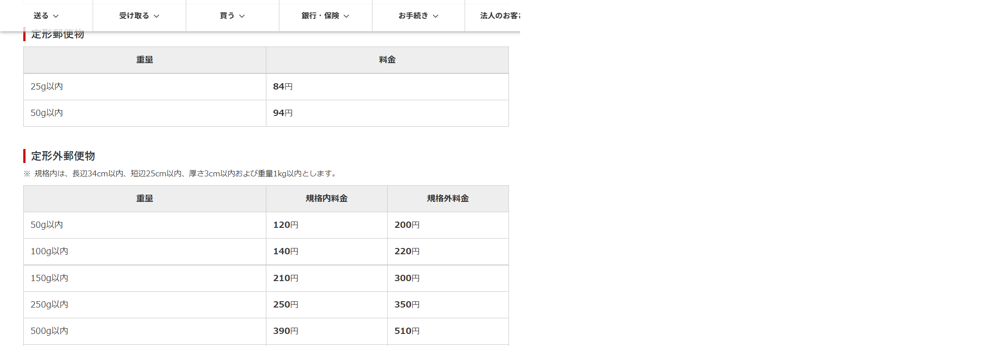

# 事務関連マニュアル
## 休日出勤について
前日の昼までに上長と相談の上、社長に個別に申請します。

休日出勤時のタイムカードの打刻漏れには特に注意してください。
## 経費の清算について
1. 資料代
1. 通信費
1. 消耗品費

|摘要|内容|
|--|--|
|資料代|書籍代 有料アプリ|
|通信費|切手 宅配便料金|
|消耗品費|文具 台所用品|

## 宅配便の発送について
webサイトにアクセスして集荷依頼を送ります
## 電話、来客対応について
## ゴミ収拾について
## プリンタについて
## 大容量データの送受信について